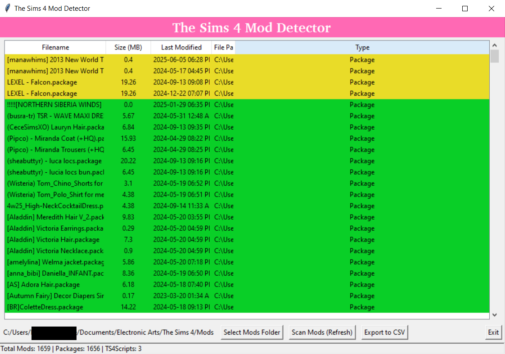

# The Sims 4 Mod Detector

This project is a Python-based tool that detects mods for users who play The Sims 4.

# Features (Planned and are currently in progress)
- Scan The Sims 4 Mods/ directory for .package and .ts4script files

- Display file details [size, last modified, full path]

- Detect duplicate mods (by filename and hash)

- Flag outdated mods based on last modified date

- Group files by folder or creator (if metadata is available)

# Tech Stack

- Language: Python 3
- Libraries: os, pathlib, hashlib, tkinter (planned)
- Packaging: pyinstaller for executable version (planned)

# Screenshot of Project 
